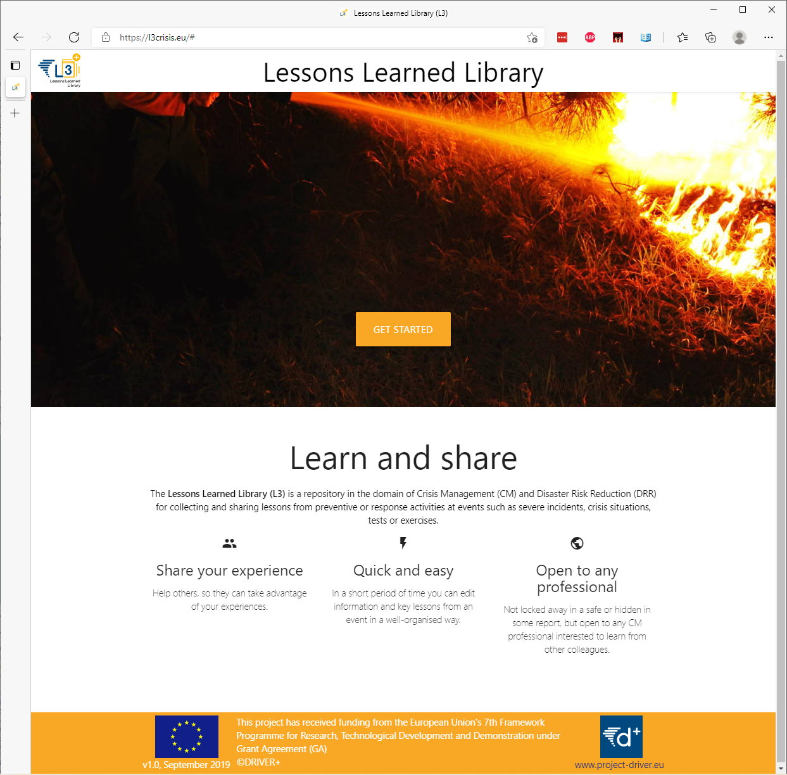
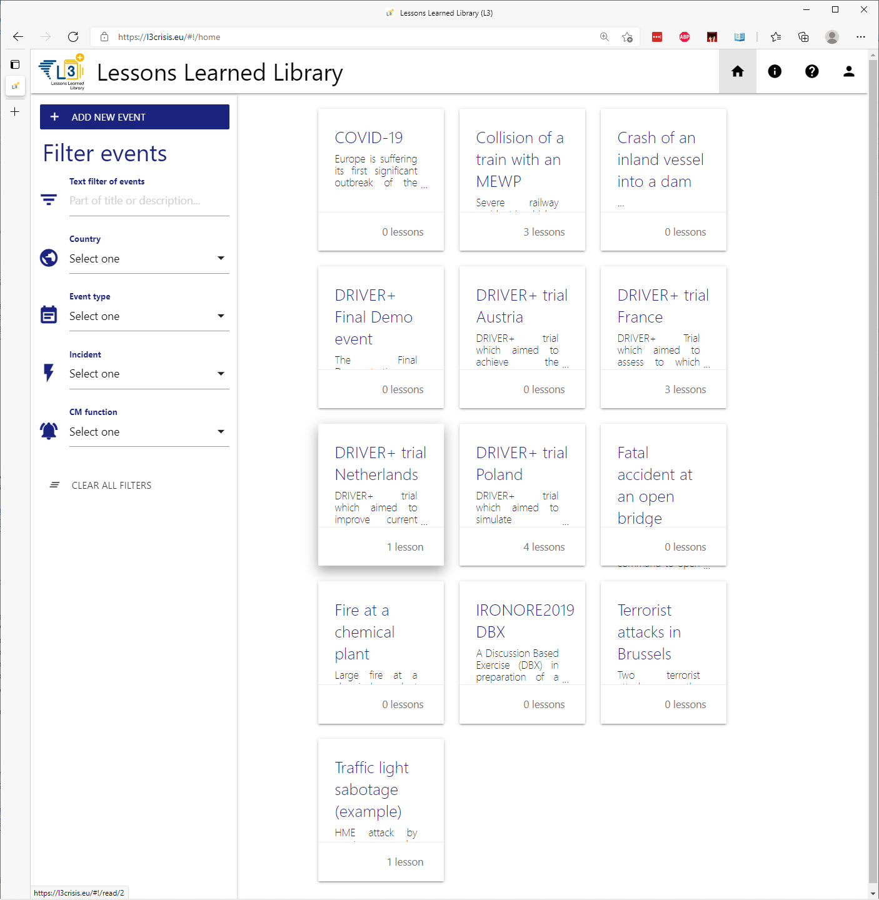
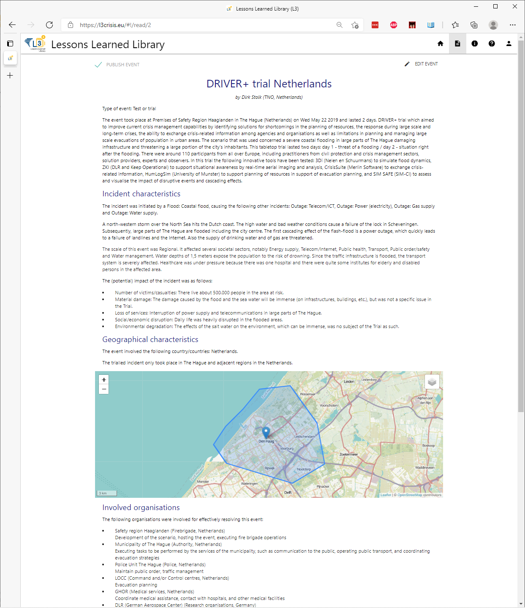
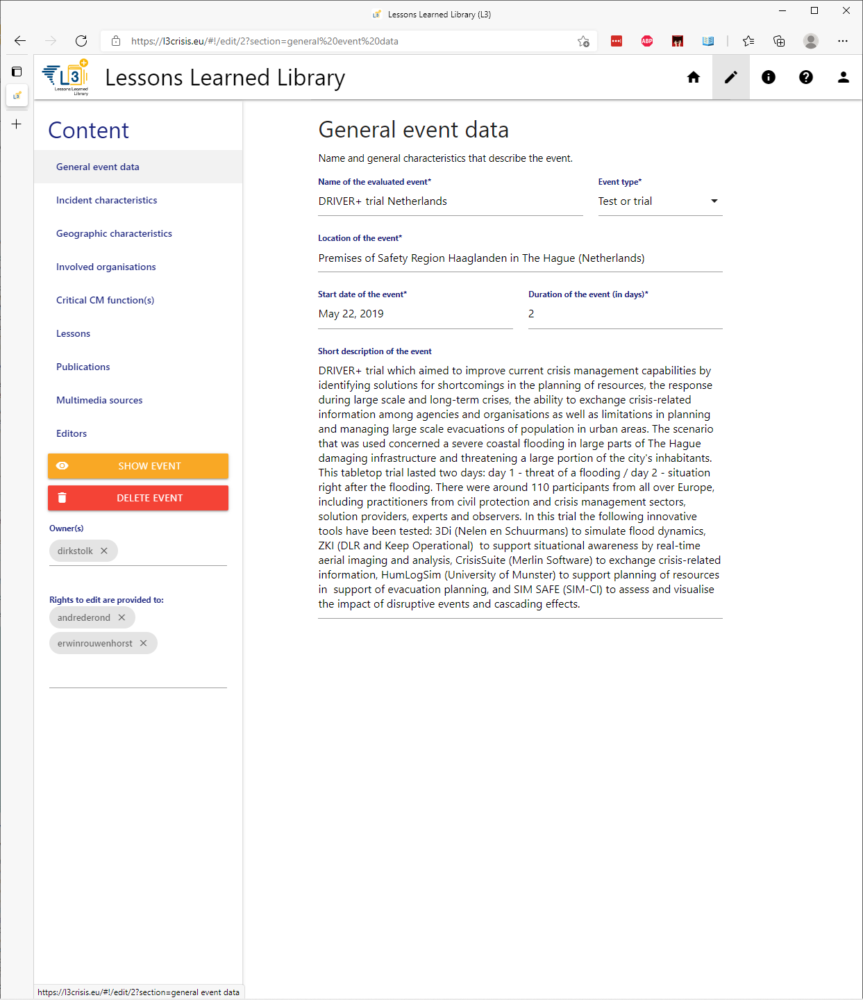
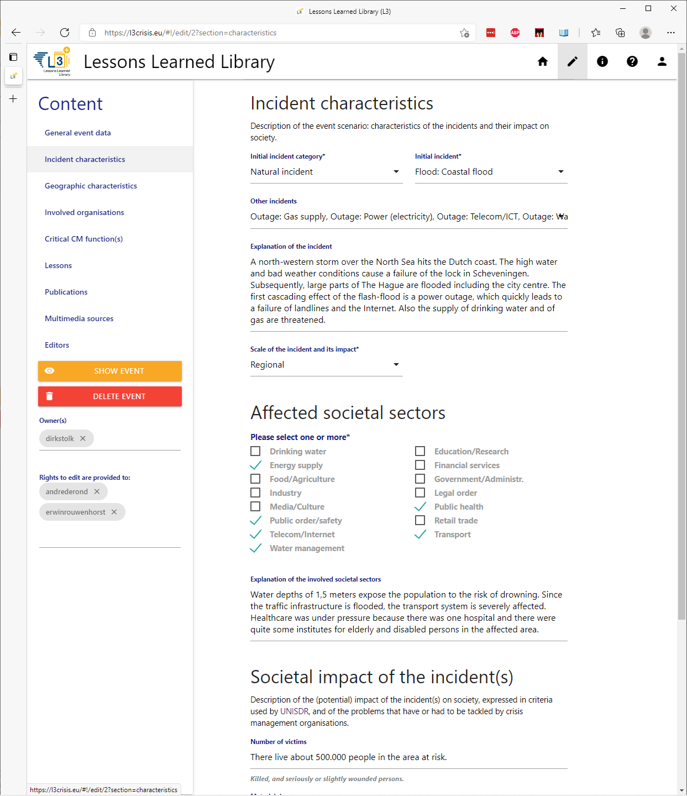
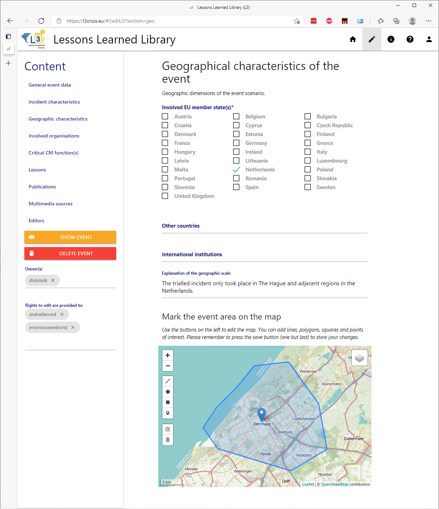
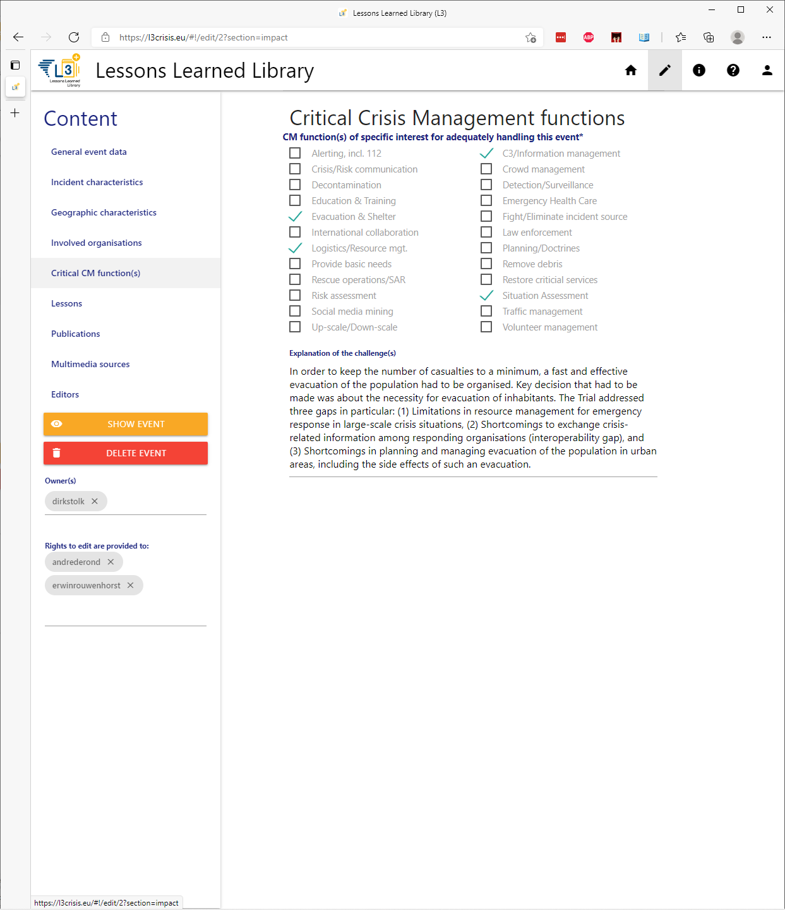
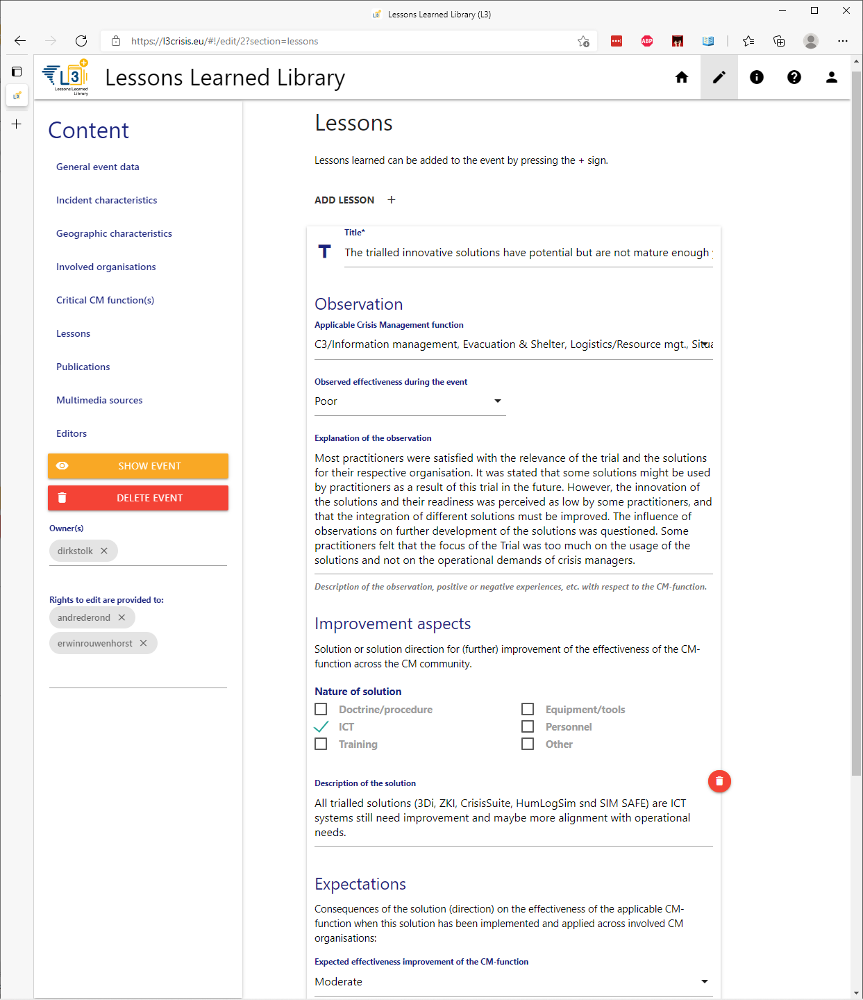
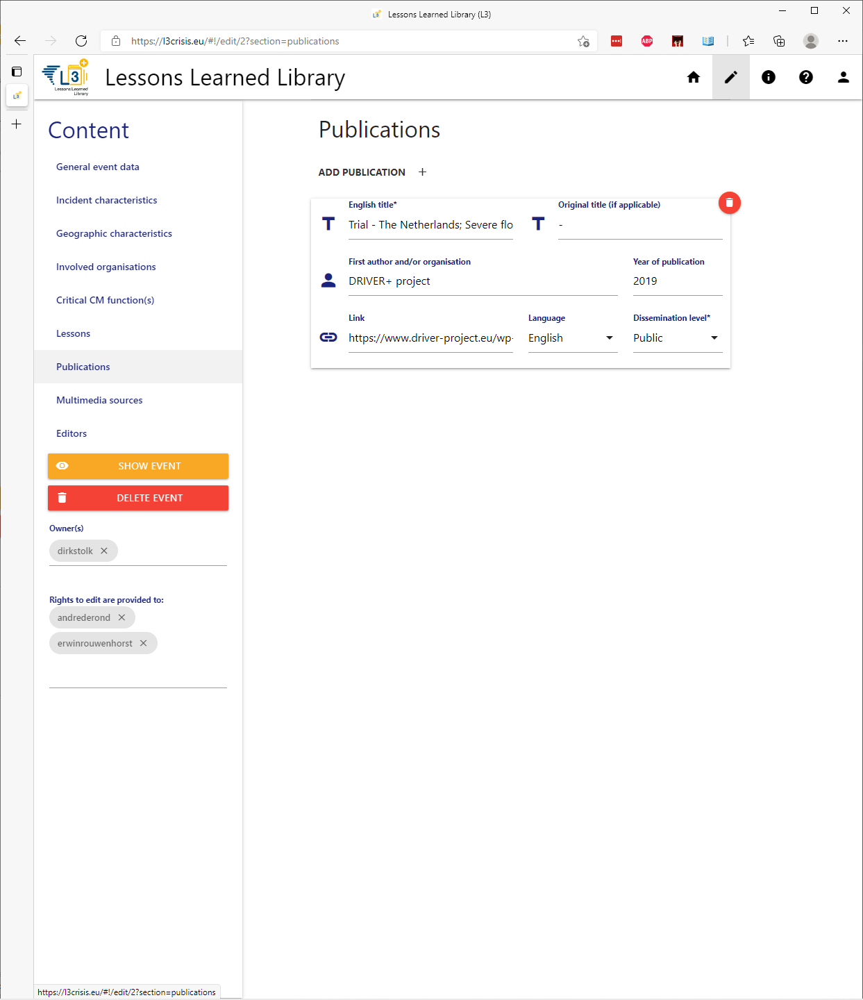
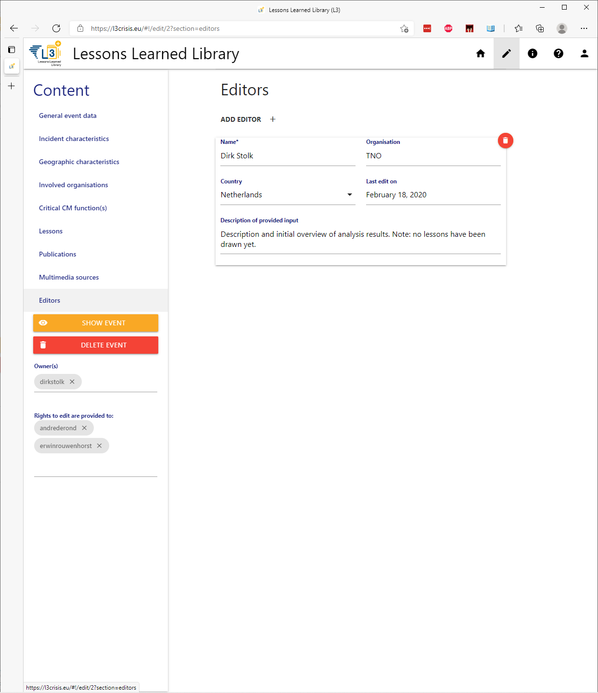

# LESSONS-LEARNED-FRAMEWORK

A web application for storing and searching your lessons learned. See [l3crisis.eu](https://l3crisis.eu) for the live version.



## Installation

Install all dependencies, start the database service and run parcel to bundle your dependencies. You can access the application at [http://localhost:3000](http://localhost:3000).

```bash
npm i
npm build:domain
npm run serve
```

## Development

As above, but now run `parcel` in watch mode.

```bash
npm i
npm start
```

### Environment settings

- LOKI_PORT: to change the output port, default 3000, e.g. `set LOKI_PORT=80` to serve it at [http://localhost](http://localhost).
- NODE_DEV: When set to `development`, every server request is logged to the command line. Set it to `production` to stop logging requests.

## Screenshots












